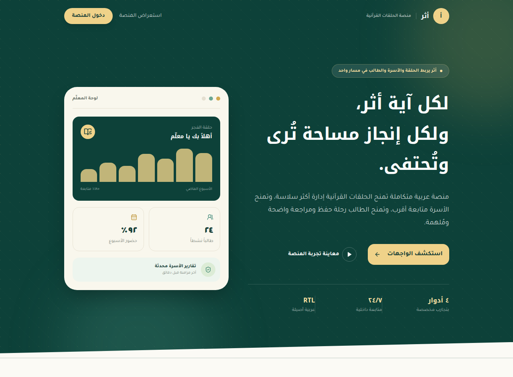
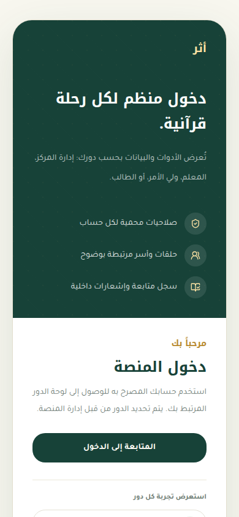
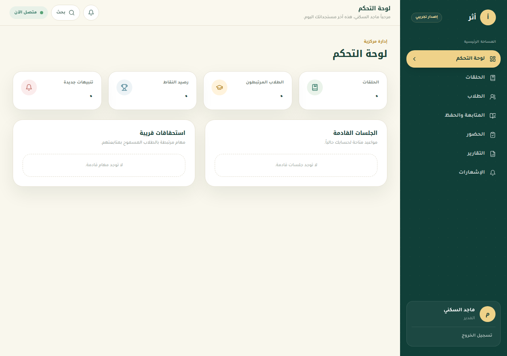
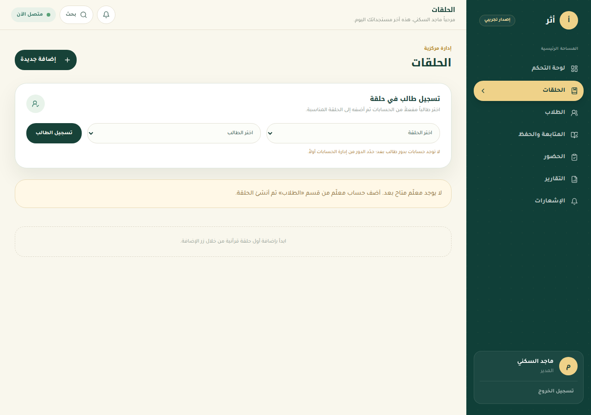
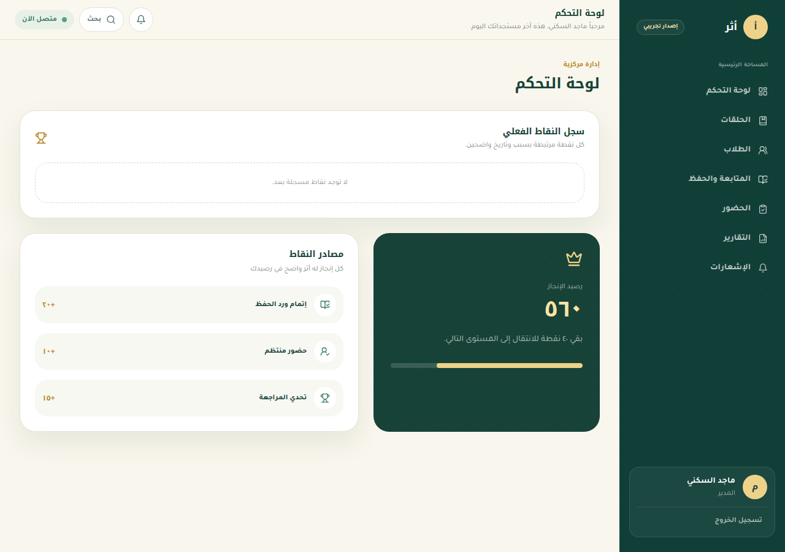
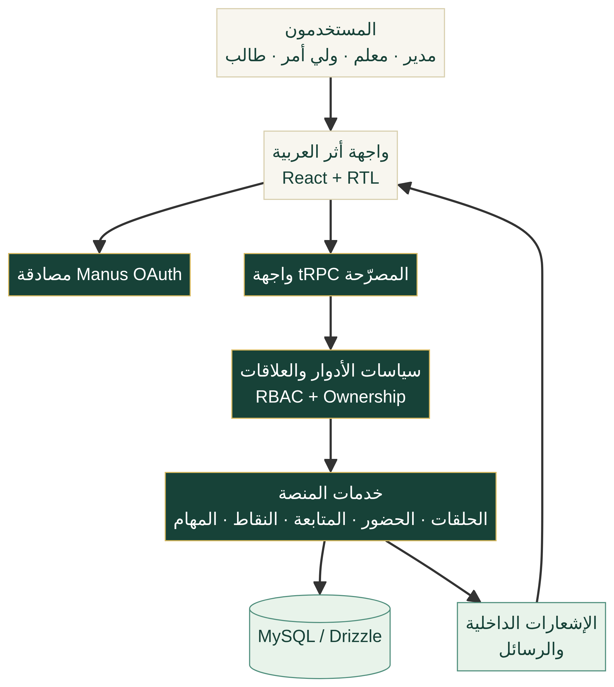

# أثر — منصة إدارة حلقات تحفيظ القرآن

[](#) [](https://community.itqan.dev/) [](LICENSE)

**أثر** منصة ويب عربية لإدارة حلقات تحفيظ القرآن الكريم. تجمع في تجربة واحدة إدارة الحلقات والجلسات، متابعة الحفظ والمراجعة، الحضور، النقاط، المهام، التقارير، الإشعارات، والرسائل الداخلية؛ مع صلاحيات منفصلة للمدير والمعلم وولي الأمر والطالب.



## معرض الواجهات

| تسجيل الدخول | لوحة التحكم |
|---|---|
|  |  |

| إدارة الحلقات | النقاط والمتابعة |
|---|---|
|  |  |

## لماذا أثر؟

تمثل المنصة مساحة عمل هادئة وواضحة للحلقات القرآنية: يرى المدير مؤشرات الإدارة، يوثق المعلم الحفظ والحضور، وتتابع الأسرة رحلة أبنائها، بينما يشاهد الطالب مهامه ونقاطه وتقدمه. الواجهة عربية بالكامل من اليمين إلى اليسار، ومهيأة للعمل على سطح المكتب والجوال.

| المجال | ما يتضمنه الإصدار الحالي |
|---|---|
| الحلقات | إنشاء وتعديل الحلقة، تعيين المعلم، تسجيل الطالب، السعة، والجلسات |
| المتابعة | الحفظ، المراجعة، التجويد، الملاحظات، واحتساب النقاط تلقائياً |
| الحضور | إنشاء الجلسات، الحضور والتأخر والغياب والاعتذار، وإشعارات الأسرة |
| الأدوار | مدير، معلم، ولي أمر، طالب، مع فصل الوصول بحسب العلاقة والصلاحية |
| التواصل | إشعارات داخلية، حالة قراءة، ورسائل بين الأطراف المصرح لها |
| المجتمع | ملفات مساهمة، قوالب GitHub، ووثائق عربية قابلة للتوسع |

## لقطات من التجربة

المسارات الأساسية تشمل لوحة التحكم، الحلقات، الطلاب، المتابعة والحفظ، الحضور، الجدول، المهام، التقارير، النقاط، الإشعارات، والرسائل.

## البنية التقنية

يعتمد المشروع على React وTypeScript وTailwind CSS في الواجهة، وExpress وtRPC في الخادم، وDrizzle مع MySQL/TiDB لطبقة البيانات، ومصادقة Manus OAuth. يعرض المخطط التالي تدفق طبقات المنصة:



## التشغيل محلياً

### المتطلبات

يلزم Node.js 22+ وpnpm، إضافة إلى قاعدة MySQL/TiDB ومتغيرات البيئة الخاصة بالمصادقة وقاعدة البيانات. لا تُضمّن الأسرار أو ملفات البيئة في المستودع.

### الخطوات

```bash
pnpm install
pnpm check
pnpm test
pnpm dev
```

لتهيئة مخطط قاعدة البيانات، راجع `drizzle/schema.ts` ثم أنشئ الترحيل وطبقه على قاعدة البيانات الخاصة بك. لا تنسَ توفير متغير `DATABASE_URL` ومتغيرات OAuth قبل تشغيل بيئة إنتاجية.

## الجودة والاختبارات

تغطي الاختبارات سياسات الوصول، عزل بيانات الأدوار، الحلقات، الحضور، المتابعة، النقاط، المهام، الرسائل، والإشعارات. شغّل الفحوصات التالية قبل فتح طلب دمج:

```bash
pnpm check
pnpm test
```

## المساهمة

نرحب بالمساهمات التي تجعل إدارة الحلقات القرآنية أكثر فائدة وإنصافاً. ابدأ بقراءة [دليل المساهمة](CONTRIBUTING.md)، ثم ألقِ نظرة على [مدونة السلوك](CODE_OF_CONDUCT.md) و[مجتمع أثر](docs/COMMUNITY.md).

للنقاش حول المبادرات والأدوات القرآنية، يمكن متابعة [مجتمع إتقان](https://community.itqan.dev/).

## خارطة الطريق

تركز الدفعات التالية على توسيع مكونات الجوال، استكمال اختبارات عزل الصلاحيات الدقيقة، تنقيح تجربة التقارير، وإتاحة تكاملات اختيارية للمؤسسات.

## الترخيص

المشروع متاح بموجب [رخصة MIT](LICENSE).

---

# Athar — Qur’an Circle Management Platform

**Athar** is an Arabic-first web platform for Qur’an memorization circles. It brings circle management, sessions, memorization and revision tracking, attendance, points, tasks, reports, in-app notifications, and role-scoped messaging into one respectful experience for administrators, teachers, guardians, and students.

## Overview

The application is built for full RTL usage and responsive desktop/mobile interaction. It uses React, TypeScript, Tailwind CSS, Express, tRPC, Drizzle, and MySQL/TiDB, with role and relationship based access controls. See the Arabic section above for the complete feature overview and visual gallery.

## Architecture

The client communicates with authenticated tRPC procedures. Server policies apply role and ownership rules before accessing circles, students, attendance, progress records, points, tasks, messages, and notifications. The database schema is defined in `drizzle/schema.ts`.

## Getting Started

Install dependencies with `pnpm install`, then validate the project with `pnpm check` and `pnpm test`. A production setup requires a MySQL/TiDB database, `DATABASE_URL`, and OAuth environment variables. Never commit real credentials or `.env` files.

## Contributing

We welcome code, design, documentation, accessibility, Arabic copy, and Qur’anic-technology contributions. Please read [CONTRIBUTING.md](CONTRIBUTING.md) and [CODE_OF_CONDUCT.md](CODE_OF_CONDUCT.md), open a focused issue, and submit a pull request with passing checks. For wider discussion, visit [Itqan Community](https://community.itqan.dev/).
